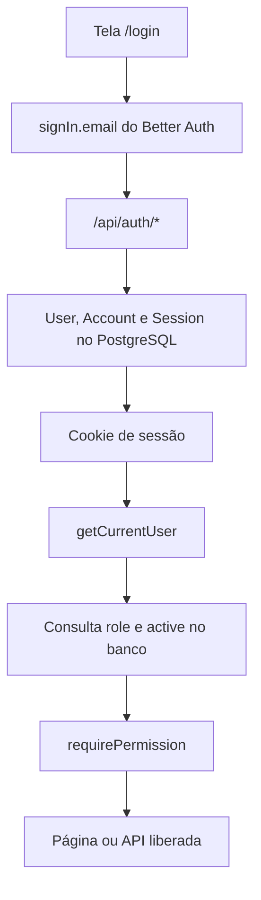
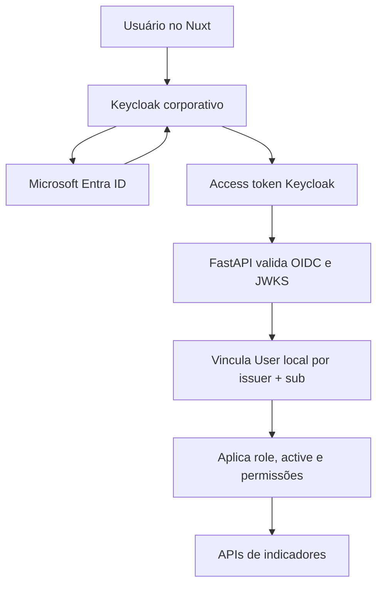

# Migração da autenticação: Better Auth para Keycloak + Microsoft Entra ID

> Projeto: Central de Indicadores
> Destino previsto: Nuxt/Vue no frontend e FastAPI no backend (ver [`migration-fastapi-nuxt.md`](migration-fastapi-nuxt.md))
> Base analisada: branch `main`, revisão `48c1ecfe40a3a64c6deb92097764f9ffc6b245e3`, em 17/08/2026
> Status: documento de planejamento; nenhuma alteração de autenticação foi aplicada ao projeto

## 1. Objetivo

Este documento registra como a autenticação funciona hoje e define um caminho
seguro para substituí-la pelo Keycloak corporativo durante a migração para o
Hub de Automação.

O nome correto da plataforma é **Keycloak**. Ela não deve ser tratada como uma
API que recebe e-mail e senha da Microsoft dentro da Central de Indicadores.
O fluxo esperado é de redirecionamento por OpenID Connect (OIDC): a aplicação
confia no Keycloak e o Keycloak, como intermediador de identidade, oferece o
login com a conta corporativa Microsoft.

Este documento é o plano detalhado que substitui, para o tema autenticação, a
orientação genérica de [`corporate-integration.md`](corporate-integration.md)
e a seção "Autenticação" de [`migration-fastapi-nuxt.md`](migration-fastapi-nuxt.md) —
ambos continuam válidos para o restante da migração, mas devem apontar para
este arquivo quando o assunto for login/SSO.

## 2. Resumo executivo

Hoje a Central de Indicadores usa:

- Better Auth com e-mail e senha;
- sessões persistidas no PostgreSQL pelas tabelas `Session` e `Account`;
- cookies HttpOnly, `SameSite=Lax` e `Secure` em produção;
- sessão com duração de 8 horas e renovação a cada 1 hora de atividade;
- cadastro público desabilitado;
- perfis locais `VIEWER`, `ANALYST` e `ADMIN`;
- confirmação do perfil e do status `active` diretamente no banco a cada
  resolução de usuário;
- autorização no servidor por meio de `requirePermission()`.

Depois da migração, a recomendação é:

- **Keycloak autentica** o usuário;
- **Microsoft Entra ID** é configurado no Keycloak como provedor corporativo;
- o frontend utiliza Authorization Code Flow com PKCE, ou o padrão BFF já
  adotado pelo Hub;
- o FastAPI valida o access token emitido pelo Keycloak, incluindo assinatura,
  emissor, audiência e validade;
- o `User.id` local continua sendo usado nas relações de auditoria,
  importações e publicações;
- inicialmente, `role` e `active` continuam no banco da aplicação para
  preservar o comportamento atual;
- a criação de usuários com senha local deixa de existir após o corte;
- as tabelas específicas do Better Auth só são removidas depois do período de
  estabilização e rollback.

O principal ponto de atenção é que `src/server/auth/provider.ts` contém apenas
uma interface preparatória. O fluxo real **não usa essa interface**: login,
sessão e logout ainda importam o Better Auth diretamente. Portanto, a migração
exige substituir esses pontos concretos; não basta criar uma nova classe que
implemente `AuthenticationProvider`. (Confirmado lendo `src/server/auth/session.ts`,
que importa `auth` de `@/server/auth` — o wrapper Better Auth — e nunca referencia
`provider.ts`; ver seção 11 para o mesmo engano repetido em outros documentos.)

## 3. Fluxo atual



### 3.1 Arquivos envolvidos

| Arquivo | Responsabilidade atual | Ação na migração |
|---|---|---|
| `package.json` | Declara `better-auth` | Remover somente após o corte do Next.js |
| `src/server/auth/index.ts` | Configura Better Auth, cookies, sessão e campos extras | Substituir pela configuração OIDC da stack-alvo |
| `src/server/auth/client.ts` | Exporta `signIn`, `signOut` e `useSession` | Substituir pelo cliente/composable corporativo |
| `src/app/api/auth/[...all]/route.ts` | Expõe os handlers do Better Auth | Não portar para o FastAPI |
| `src/app/(auth)/login/page.tsx` | Envia e-mail e senha para `signIn.email` | Trocar por redirecionamento ao Keycloak |
| `src/server/auth/session.ts` | Resolve a sessão e reconfirma `role`/`active` | Recriar como dependências do FastAPI |
| `src/server/auth/provider.ts` | Apenas declara uma interface futura, não conectada ao fluxo real | Usar como referência de contrato, não como implementação existente |
| `src/server/permissions/index.ts` | Mantém a matriz de autorização | Portar sem alterar a regra de negócio |
| `src/app/(dashboard)/layout.tsx` | Protege todas as páginas do dashboard no servidor | Substituir por middleware de rota do Nuxt e proteção da API |
| `src/components/layout/UserMenu.tsx` | Executa logout local do Better Auth | Executar logout OIDC/Keycloak |
| `src/app/api/usuarios/route.ts` | Lista usuários e cria credenciais locais | Remover criação por senha; manter gestão de perfil se decidida como local |
| `src/app/api/usuarios/[id]/route.ts` | Edita nome, perfil e status | Portar conforme a fonte de verdade escolhida |
| `src/features/admin/components/UsersManager.tsx` | Formulário de usuário/senha e gestão de perfil | Retirar senha e adaptar para usuários federados |
| `prisma/schema.prisma` | Define `User`, `Session`, `Account` e `Verification` | Preservar `User`; aposentar tabelas do Better Auth posteriormente |
| `prisma/seed.ts` | Cria o primeiro admin e a credencial local | Separar settings do seed de usuário; definir conta de emergência |
| `src/lib/validation/env.ts` | Exige variáveis `BETTER_AUTH_*` | Trocar pelas variáveis Keycloak/OIDC |

### 3.2 Detalhes da configuração atual

Em `src/server/auth/index.ts`:

- `emailAndPassword.enabled = true`;
- `disableSignUp = true`;
- senha mínima de 8 caracteres;
- `session.expiresIn = 8 horas`;
- `session.updateAge = 1 hora`;
- `basePath = /api/auth`;
- origens confiáveis são montadas a partir de `BETTER_AUTH_URL`,
  `NEXT_PUBLIC_APP_URL` e URLs da Vercel;
- o usuário recebe os campos adicionais `role`, `active`, `authProvider`,
  `externalUserId` e `lastLoginAt`.

Em `getCurrentUser()`:

1. o Better Auth lê a sessão pelos headers/cookies;
2. o sistema busca novamente o usuário no PostgreSQL pelo `session.user.id`;
3. o banco local é a fonte de verdade para `role` e `active`;
4. usuário ausente ou inativo é tratado como não autenticado.

Em `requirePermission()`:

1. `requireUser()` exige um usuário autenticado;
2. `assertCan()` verifica a permissão na matriz local;
3. ausência de sessão resulta em HTTP `401`;
4. falta de permissão resulta em HTTP `403`.

### 3.3 Perfis e permissões atuais

Esta tabela deve ser tratada como a regra de negócio oficial na migração (ela
espelha exatamente `src/server/permissions/index.ts` e
[`roles-permissions.md`](roles-permissions.md)):

| Permissão | VIEWER | ANALYST | ADMIN |
|---|:---:|:---:|:---:|
| `indicators:read` | ✓ | ✓ | ✓ |
| `indicators:export` | ✓ | ✓ | ✓ |
| `indicators:edit` |  |  | ✓ |
| `indicators:publish` |  |  | ✓ |
| `import:run` |  | ✓ | ✓ |
| `import:read` |  | ✓ | ✓ |
| `users:manage` |  |  | ✓ |
| `audit:read` |  |  | ✓ |
| `settings:manage` |  |  | ✓ |

Importante: o perfil `ANALYST` **não publica** indicadores segundo o código
(`indicators:publish` só existe para `ADMIN`). Qualquer resumo de perfis fora
deste documento e de `roles-permissions.md` que diga o contrário está errado;
na migração, deve prevalecer a matriz implementada, salvo decisão formal de
regra de negócio.

## 4. Arquitetura-alvo



### 4.1 Separação de responsabilidades

| Camada | Responsabilidade |
|---|---|
| Microsoft Entra ID | Autenticar a conta corporativa e aplicar as políticas da empresa, como MFA |
| Keycloak | Intermediar o login Microsoft, emitir tokens para a Central e manter a sessão SSO |
| Nuxt/Vue | Iniciar login, manter o estado da sessão, renovar token e enviá-lo à API |
| FastAPI | Validar o token e aplicar autorização em todas as rotas |
| PostgreSQL da Central | Preservar o usuário interno, perfil, status e relações de auditoria |

Para a Central, o emissor confiável deve ser o **Keycloak**, não a Microsoft.
O segredo da integração Microsoft deve permanecer no Keycloak e nunca ser
exposto no frontend nem armazenado neste repositório.

### 4.2 Fluxo OIDC recomendado

1. O usuário acessa uma página protegida no Nuxt.
2. O frontend redireciona o navegador para o endpoint de autorização do
   Keycloak.
3. O Keycloak exibe o provedor Microsoft ou redireciona diretamente para ele.
4. A Microsoft autentica a conta corporativa e devolve o resultado ao
   Keycloak.
5. O Keycloak devolve um authorization code à URL de callback da aplicação.
6. O code é trocado por tokens usando Authorization Code Flow com PKCE `S256`,
   ou pelo BFF corporativo se esse for o padrão do Hub.
7. O frontend chama o FastAPI com `Authorization: Bearer <access_token>`.
8. O FastAPI valida o token e resolve o usuário local.
9. A permissão é verificada antes de executar a regra do endpoint.

Não implementar Resource Owner Password Grant e não enviar a senha corporativa
ao FastAPI. O frontend também não deve usar ID token para autorizar a API; a API
deve receber e validar o **access token**.

### 4.3 Descoberta e validação dos tokens

O Keycloak publica os metadados OIDC em:

```text
https://<host-keycloak>/realms/<realm>/.well-known/openid-configuration
```

O FastAPI deve obter por discovery o `jwks_uri` e validar, no mínimo:

- assinatura com uma chave pública atual do realm;
- algoritmo permitido, normalmente `RS256`, sem aceitar `none`;
- `iss` exatamente igual ao issuer configurado;
- `aud` contendo a audiência da API;
- `exp` e, quando presente, `nbf`;
- `sub` presente e não vazio;
- token destinado à API, não apenas ao frontend;
- permissões/roles somente a partir de claims previamente acordadas.

As chaves JWKS devem ser cacheadas e atualizadas quando o `kid` mudar. Não é
necessário chamar o Keycloak para cada requisição quando o access token é um JWT
validado localmente.

### 4.4 Clientes sugeridos no Keycloak

Se o padrão do Hub permitir, separar os clientes por responsabilidade:

| Cliente | Tipo | Finalidade |
|---|---|---|
| `central-indicadores-web` | Público, Standard Flow + PKCE | Login do Nuxt |
| `central-indicadores-api` | Recurso/audiência da API | Audiência e client roles do FastAPI |

O access token emitido ao frontend deve conter `central-indicadores-api` em
`aud`. Caso o Hub use um único cliente ou um gateway/BFF, seguir o padrão
corporativo, mas manter a validação explícita de audiência.

Configurar URLs separadas para desenvolvimento, homologação e produção:

- redirect URIs exatas;
- post-logout redirect URIs;
- web origins permitidas;
- HTTPS obrigatório fora do ambiente local;
- PKCE `S256`;
- CORS limitado à origem real do frontend.

## 5. Identidade local e provisionamento

### 5.1 O que deve ser preservado

O `User.id` local é referenciado por importações, auditoria, publicações e
justificativas. Ele não deve ser substituído pelo `sub` do Keycloak.

A recomendação é manter:

- `User.id`: UUID interno e estável;
- `User.email` e `User.name`: dados de exibição;
- `User.role`: autorização da aplicação na primeira fase;
- `User.active`: bloqueio administrativo local;
- `User.externalUserId`: `sub` do Keycloak;
- `User.authProvider`: alterar de `LOCAL/HUB` para um valor documentado, por
  exemplo `KEYCLOAK`;
- `User.lastLoginAt`: atualizar em login ou de forma controlada para não gerar
  escrita em toda requisição (hoje o campo existe no schema, mas não há
  nenhum ponto do código que o atualize — ver seção 11).

Para permitir mais de um emissor no futuro, o vínculo ideal é
`(externalIssuer, externalUserId)`, com restrição única. Se haverá apenas um
realm, ao menos `externalUserId` deve se tornar único para usuários Keycloak.

### 5.2 Primeiro login (JIT provisioning)

Fluxo recomendado:

1. validar completamente o access token;
2. procurar o usuário por `issuer + sub`;
3. se existir, atualizar somente os dados de perfil permitidos;
4. se não existir, criar o usuário local conforme a política de acesso;
5. aplicar `VIEWER` como menor privilégio ou negar o acesso até aprovação;
6. registrar a associação e o primeiro login na auditoria;
7. manter `active=false` como bloqueio mesmo que o token Keycloak seja válido.

Não vincular automaticamente uma identidade nova a uma conta local somente
porque os e-mails coincidem. A própria documentação do Keycloak alerta que o
vínculo automático de contas por e-mail pode ser uma falha de segurança. Para
as contas já existentes, fazer uma migração revisada e única.

### 5.3 Migração dos usuários existentes

1. exportar `id`, `email`, `name`, `role` e `active` dos usuários atuais;
2. obter do time de IAM o `sub` Keycloak correspondente a cada conta aprovada;
3. normalizar e comparar e-mails, mas exigir revisão das correspondências;
4. preencher `authProvider`, `externalUserId` e, se adotado, `externalIssuer`;
5. preservar o UUID interno e todas as relações existentes;
6. não migrar hashes de senha;
7. invalidar as sessões Better Auth no momento do corte;
8. exigir novo login pelo Keycloak.

As tabelas `Session`, `Account` e `Verification` pertencem ao Better Auth. Elas
podem permanecer temporariamente para rollback, mas não devem continuar como
fonte de autenticação depois do corte.

### 5.4 Fonte de verdade dos perfis

Esta decisão deve ser fechada antes da implementação.

**Opção recomendada para a primeira fase: perfil local**

- Keycloak confirma quem é o usuário;
- o banco da Central define `VIEWER`, `ANALYST`, `ADMIN` e `active`;
- preserva a tela administrativa e exige menos mudança;
- o formulário deixa de criar senha e passa a aprovar/vincular usuários SSO.

**Opção futura: perfil corporativo**

- grupos do Entra ID são mapeados no Keycloak;
- client roles do Keycloak são emitidas em `resource_access` ou claim acordada;
- a Central apenas converte os valores em permissões;
- a edição local de perfis deve ser removida para evitar duas fontes de verdade.

Não misturar as duas opções sem uma regra explícita de precedência. Em caso de
dúvida ou claim desconhecida, aplicar o menor privilégio e negar ações
administrativas.

## 6. Equivalentes na stack FastAPI + Nuxt

### 6.1 Backend FastAPI

Criar dependências equivalentes às atuais:

| Atual no Next.js | Equivalente no FastAPI |
|---|---|
| `getCurrentUser()` | `get_current_user()` valida JWT e resolve o `User` local |
| `requireUser()` | dependência que retorna `401` sem token válido |
| `requirePermission(name)` | fábrica de dependência que retorna `403` sem permissão |
| `handleApiError()` | handlers globais para `401`, `403`, `422` e `500` |
| `recordAudit()` | serviço de auditoria usando o `User.id` local |

Contrato conceitual:

```python
identity = verify_access_token(
    token,
    issuer=KEYCLOAK_ISSUER,
    audience=KEYCLOAK_AUDIENCE,
    jwks_uri=KEYCLOAK_JWKS_URI,
    algorithms=["RS256"],
)

user = resolve_local_user(
    issuer=identity["iss"],
    subject=identity["sub"],
    email=identity.get("email"),
    name=identity.get("name") or identity.get("preferred_username"),
)

if not user.active:
    deny_access()
```

Toda rota de negócio deve declarar sua dependência de autorização. Ocultar um
botão no Nuxt não substitui a verificação no FastAPI.

### 6.2 Frontend Nuxt/Vue

O frontend deve ter:

- plugin/composable único para autenticação;
- middleware global ou por rota para páginas protegidas;
- redirecionamento ao Keycloak no login;
- renovação controlada antes do vencimento do access token;
- interceptor/wrapper de `fetch` para enviar o Bearer token;
- tratamento centralizado de `401` e `403`;
- logout OIDC com redirecionamento de retorno permitido;
- nome e perfil obtidos de uma rota `/me` do FastAPI ou de claims validadas.

Se for utilizado `keycloak-js`, manter tokens em memória; não gravá-los em
`localStorage` ou em logs. Se o Hub usa BFF, preferir cookie HttpOnly e manter os
tokens fora do JavaScript, seguindo exatamente o padrão corporativo.

### 6.3 Logout

O logout atual apenas encerra a sessão Better Auth. No destino, o botão deve
encerrar a sessão conforme o padrão OIDC/Keycloak e limpar o estado local.

Se a aplicação apagar somente seu token sem encerrar a sessão do Keycloak, o
usuário poderá parecer entrar novamente de forma imediata por ainda ter SSO
ativo. A equipe deve definir se o comportamento desejado é:

- sair apenas da Central de Indicadores; ou
- executar Single Sign-Out no Keycloak e possivelmente nas aplicações do Hub.

## 7. Variáveis de ambiente sugeridas

Os nomes definitivos devem seguir o padrão do Hub.

### Frontend público

```env
NUXT_PUBLIC_KEYCLOAK_URL="https://sso.empresa/"
NUXT_PUBLIC_KEYCLOAK_REALM="<realm>"
NUXT_PUBLIC_KEYCLOAK_CLIENT_ID="central-indicadores-web"
NUXT_PUBLIC_API_BASE_URL="https://api.empresa/central-indicadores"
```

### Backend

```env
KEYCLOAK_ISSUER="https://sso.empresa/realms/<realm>"
KEYCLOAK_AUDIENCE="central-indicadores-api"
KEYCLOAK_JWKS_URI="https://sso.empresa/realms/<realm>/protocol/openid-connect/certs"
KEYCLOAK_ALLOWED_ALGORITHMS="RS256"
KEYCLOAK_ROLE_SOURCE="LOCAL"
```

`KEYCLOAK_JWKS_URI` pode ser descoberto pelo endpoint `well-known`, evitando
duplicação de configuração. Um `client secret` só é necessário no aplicativo
se o padrão adotado for cliente confidencial/BFF ou fluxo servidor-servidor.
Nunca colocar segredo em variável `NUXT_PUBLIC_*`.

Após o corte, remover gradualmente:

```env
BETTER_AUTH_SECRET
BETTER_AUTH_URL
INITIAL_ADMIN_PASSWORD
```

## 8. Informações que o time de automação/IAM precisa fornecer

Antes de escrever a integração, confirmar:

1. URL exata do Keycloak e nome do realm;
2. se será usado um client existente do Hub ou um client novo;
3. client ID do frontend e audiência esperada pela API;
4. padrão adotado pelo Hub: `keycloak-js`, biblioteca OIDC, BFF ou gateway;
5. redirect URIs e post-logout redirect URIs por ambiente;
6. web origins/CORS por ambiente;
7. claims garantidas: `sub`, `email`, `email_verified`, `name` e
   `preferred_username`;
8. onde chegam grupos e roles no token;
9. se os perfis da Central continuam locais ou serão corporativos;
10. grupo mínimo autorizado a acessar a aplicação;
11. política de JIT provisioning e de desligamento de colaboradores;
12. tempos de access token, refresh token e sessão SSO;
13. comportamento desejado do logout;
14. necessidade de service accounts para automações;
15. política de conta administrativa de emergência;
16. cabeçalhos confiáveis do proxy, caso exista gateway na frente do FastAPI.

Solicitar também um access token de homologação, sem dados sensíveis além do
necessário, para conferir `iss`, `aud`, `azp`, `sub`, roles e formato dos claims.
O token não deve ser anexado a issues, commits ou documentação permanente.

## 9. Plano de migração

### Fase 0 — contrato de identidade

- confirmar arquitetura do Hub e decisões da seção 8;
- definir fonte de verdade de roles;
- registrar clients, redirect URIs e audiência;
- definir mapeamento dos três perfis.

### Fase 1 — Keycloak e Microsoft

- configurar o client da Central no realm corporativo;
- configurar/validar Microsoft como Identity Provider no Keycloak;
- limitar o acesso ao tenant/grupo corporativo correto;
- testar login e logout em homologação.

Esta fase pertence principalmente ao time de IAM/Automação. A Central não deve
armazenar o segredo Microsoft.

### Fase 2 — autenticação no FastAPI

- implementar discovery/JWKS;
- validar issuer, audience, assinatura e validade;
- criar `get_current_user` e `require_permission`;
- manter respostas `401` e `403` equivalentes;
- implementar vínculo com `User` local;
- preservar auditoria.

### Fase 3 — autenticação no Nuxt

- implementar login por redirecionamento;
- proteger rotas;
- anexar access token às chamadas do FastAPI;
- renovar sessão/token;
- adaptar menu do usuário e logout;
- remover formulário local de e-mail/senha.

### Fase 4 — usuários e banco

- migrar vínculos dos usuários existentes;
- adaptar a tela de usuários para SSO;
- retirar criação e armazenamento de senha local;
- adicionar restrição única do identificador externo;
- atualizar `lastLoginAt`;
- definir retenção e posterior remoção de `Session`, `Account` e
  `Verification`.

### Fase 5 — corte e limpeza

- invalidar sessões Better Auth;
- habilitar o Keycloak em produção;
- monitorar `401`, `403`, falhas de audience e falhas de callback;
- manter rollback por período definido;
- remover dependência Better Auth e variáveis antigas após estabilização;
- atualizar `README.md`, runbook de deploy e documentação operacional
  (`operations.md`, `deployment-vercel.md`).

Não é recomendável integrar Keycloak primeiro ao Next.js se o Next será
desligado logo depois. Implementar uma única vez na stack Nuxt/FastAPI, salvo se
o SSO for necessário antes da migração de framework.

## 10. Testes de aceitação

### Autenticação

- usuário não autenticado é redirecionado no frontend;
- API sem Bearer token retorna `401`;
- token expirado, com assinatura inválida, issuer errado ou audience errada
  retorna `401`;
- ID token enviado como access token é rejeitado;
- login Microsoft funciona para usuário existente;
- primeiro login segue a política de provisionamento definida;
- usuário local inativo permanece bloqueado;
- mudança de e-mail não cria nova conta quando o `sub` é o mesmo;
- callback só aceita redirect URIs cadastradas;
- logout tem o comportamento SSO decidido.

### Autorização

- `VIEWER` consulta e exporta, mas não importa, edita nem publica;
- `ANALYST` consulta, exporta e executa/consulta importações, mas não publica;
- `ADMIN` edita, publica, gerencia usuários, auditoria e configurações;
- tentativa sem permissão retorna `403`, não `404` ou `500`;
- menus ocultos não são a única barreira: a API também bloqueia;
- alteração de role passa a valer no prazo definido pela política de cache/token.

### Continuidade

- importações continuam registrando `userId`;
- publicações continuam registrando `publishedById`;
- auditoria exibe o mesmo usuário interno;
- usuários existentes preservam seus perfis;
- não há senha, token, secret ou authorization code em logs;
- rotação das chaves JWKS não derruba a aplicação;
- queda temporária do Keycloak não invalida requests com token ainda válido,
  quando a política corporativa permitir validação local.

## 11. Riscos encontrados no estado atual

| Risco | Impacto | Tratamento |
|---|---|---|
| `AuthenticationProvider` não está conectado ao fluxo real | Migração pode ser subestimada. A mesma falha se repete em `docs/authentication.md`, `docs/corporate-integration.md` e `docs/architecture.md`, que hoje descrevem a interface como se já isolasse a aplicação do Better Auth | Substituir os pontos concretos listados na seção 3.1; os três documentos citados foram corrigidos junto com este para apontar aqui |
| `externalUserId` não possui unicidade nem issuer | Vínculos duplicados ou ambíguos | Criar chave única por provider/issuer + subject |
| `authProvider` é texto livre | Valores inconsistentes | Usar enum/constante documentada |
| `lastLoginAt` existe, mas não foi encontrado código que o atualize | Tela de usuários pode mostrar valor vazio/desatualizado | Atualizar no fluxo de login com controle de escrita |
| Criação de usuário depende do hash interno do Better Auth | Não é portável | Remover senha local no modelo SSO |
| Vínculo automático por e-mail | Possível associação indevida | Fazer migração revisada e usar `sub` como chave |
| Role local e role do Keycloak sem precedência definida | Escalada ou perda de acesso | Escolher uma única fonte de verdade |
| Audience não validada | Token emitido para outro cliente pode ser aceito | Exigir `aud` da API |
| Logout apenas local | Usuário continua autenticado no SSO | Implementar logout OIDC conforme política |
| README e validação citam `.env.example`, mas o arquivo não está versionado | Onboarding/deploy incompletos | Criar exemplo sem segredos na migração |

## 12. Responsáveis sugeridos

| Entrega | Responsável principal |
|---|---|
| Realm, clients, Microsoft IdP, grupos e claims | IAM / Automação |
| Validação JWT e dependências de autorização | Backend FastAPI |
| Login, renovação, guards e logout | Frontend Nuxt |
| Migração/vínculo dos usuários e constraints | Backend + banco de dados |
| Matriz `VIEWER/ANALYST/ADMIN` | Dono do produto + Planejamento |
| Testes de acesso e segurança | QA + Automação + Planejamento |
| Corte, monitoramento e rollback | DevOps / Automação |

## 13. Evidências no repositório

- [Configuração do Better Auth](https://github.com/einelucas/centraldeindicadores-vers-o2/blob/48c1ecfe40a3a64c6deb92097764f9ffc6b245e3/src/server/auth/index.ts)
- [Cliente de login e logout](https://github.com/einelucas/centraldeindicadores-vers-o2/blob/48c1ecfe40a3a64c6deb92097764f9ffc6b245e3/src/server/auth/client.ts)
- [Resolução de sessão e permissões](https://github.com/einelucas/centraldeindicadores-vers-o2/blob/48c1ecfe40a3a64c6deb92097764f9ffc6b245e3/src/server/auth/session.ts)
- [Interface preparatória não conectada](https://github.com/einelucas/centraldeindicadores-vers-o2/blob/48c1ecfe40a3a64c6deb92097764f9ffc6b245e3/src/server/auth/provider.ts)
- [Matriz de perfis e permissões](https://github.com/einelucas/centraldeindicadores-vers-o2/blob/48c1ecfe40a3a64c6deb92097764f9ffc6b245e3/src/server/permissions/index.ts)
- [Modelos de usuário e sessão](https://github.com/einelucas/centraldeindicadores-vers-o2/blob/48c1ecfe40a3a64c6deb92097764f9ffc6b245e3/prisma/schema.prisma)
- [Gestão atual de usuários locais](https://github.com/einelucas/centraldeindicadores-vers-o2/blob/48c1ecfe40a3a64c6deb92097764f9ffc6b245e3/src/app/api/usuarios/route.ts)
- [Plano geral de migração FastAPI/Nuxt](https://github.com/einelucas/centraldeindicadores-vers-o2/blob/48c1ecfe40a3a64c6deb92097764f9ffc6b245e3/docs/migration-fastapi-nuxt.md)

## 14. Referências oficiais

- [Keycloak — OpenID Connect e endpoints](https://www.keycloak.org/securing-apps/oidc-layers)
- [Keycloak — configuração de Microsoft como Identity Provider](https://www.keycloak.org/docs/latest/server_admin/index.html#_microsoft)
- [Keycloak — adapter JavaScript, Authorization Code e PKCE](https://www.keycloak.org/securing-apps/javascript-adapter)
- [Microsoft Entra ID — OpenID Connect](https://learn.microsoft.com/en-us/entra/identity-platform/v2-protocols-oidc)
- [Microsoft Entra ID — redirect URIs](https://learn.microsoft.com/en-us/entra/identity-platform/reply-url)

## 15. Decisão recomendada para a Central de Indicadores

Para reduzir risco e preservar as regras existentes:

1. usar Keycloak exclusivamente para autenticação;
2. deixar a Microsoft configurada dentro do Keycloak pelo time corporativo;
3. manter `role` e `active` no PostgreSQL da Central na primeira fase;
4. vincular o usuário pelo `sub` do Keycloak, preservando o UUID local;
5. adaptar a tela administrativa para aprovar e classificar usuários SSO, sem
   criar senhas;
6. portar `requirePermission()` para dependências do FastAPI sem mudar a matriz;
7. avaliar roles corporativas somente em uma segunda fase, depois que o fluxo
   estiver estável.

Essa abordagem troca o mecanismo de login sem misturar, no mesmo momento, uma
mudança de identidade, autorização, banco e regra de negócio.
